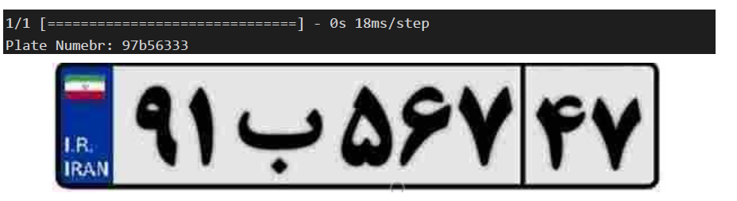
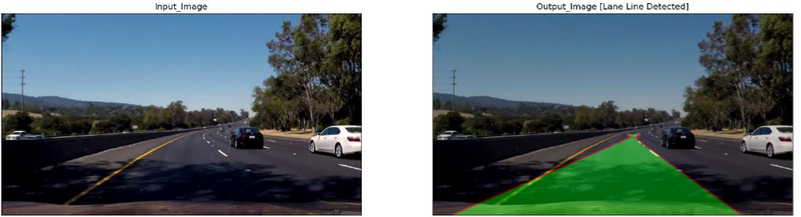
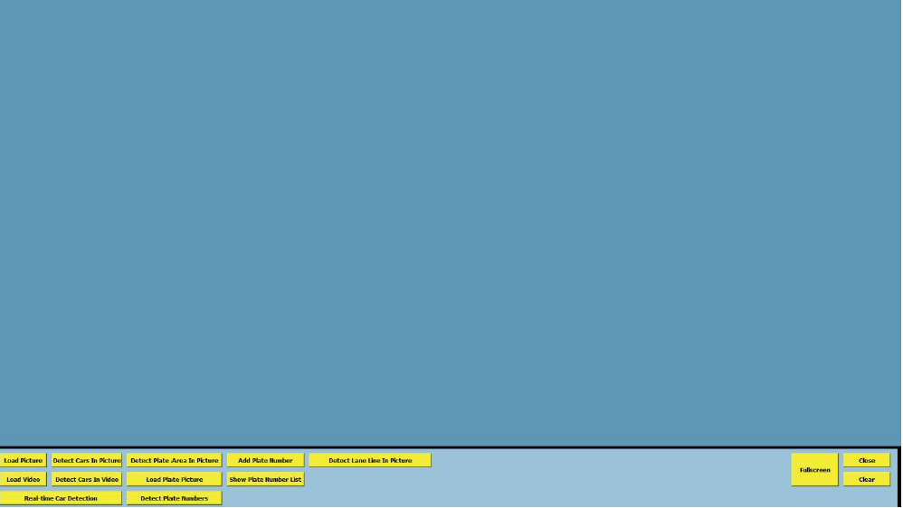

# License Plate and Lane Detection System  

## 📌 **Extended Project Overview**  
This project implements an advanced **intelligent vehicle perception system** that unifies **license plate recognition (LPR)** with **lane detection and tracking** into a single pipeline. Unlike conventional systems that treat these as separate problems, this project integrates them into a modular yet unified framework capable of real-time performance.  

Why is this important?  
- **Transportation**: LPR enables automated tolling, access control, and law enforcement.  
- **Safety**: Lane detection is essential for Advanced Driver Assistance Systems (ADAS) and autonomous vehicles.  
- **Localization**: In regions with non-Latin characters (e.g., Persian), developing localized models ensures usability where standard global systems fail.  

This system demonstrates the entire **computer vision lifecycle**: dataset construction, annotation, preprocessing, training CNNs, integrating pretrained YOLO detectors, applying image processing filters, and deploying the entire workflow in a **user-friendly PyQt GUI application**.  

---

## 🎯 Extended Objectives  
The project aimed not only to build a functioning LPR + Lane detection system, but also to:  
1. **Bridge Deep Learning with Classical CV** – CNN for classification, YOLO for detection, OpenCV for lane extraction.  
2. **Develop a Localized LPR** – Recognize Persian plates, requiring adaptation beyond typical Latin-based ANPR systems.  
3. **Design End-to-End Usability** – Deploy a GUI that allows non-technical users to load images, videos, or run real-time detection.  
4. **Benchmark Recognition Models** – Compare CNN performance with different architectures (LeNet, ResNet-lite).  
5. **Investigate Robustness** – Test lane detection under noise, lighting variations, and occlusions.  
6. **Create Modular Architecture** – So each component (digit recognition, alphabet recognition, lane detection) can be improved independently.  

---

## 🛠 Tools & Software (Detailed)  
- **Deep Learning Frameworks**: TensorFlow/Keras (CNN training, plate recognition).  
- **Object Detection**: YOLOv8 for license plate & human detection.  
- **Image Processing**: OpenCV (segmentation, filtering, edge detection, Hough transform).  
- **GUI Development**: PyQt5 (desktop application with user interaction).  
- **Datasets**:  
  - *Hoda Persian Handwritten Digits* (~80k samples).  
  - Custom-annotated Persian license plates (JSON labels).  
  - Pretrained Persian alphabet dataset (42 classes).  
- **Libraries**: NumPy, Pandas, Matplotlib, MoviePy.  

---

## 📐 Extended Methodology  

### 1. Dataset & Preprocessing  
- **Digits**: Preprocessed to grayscale 28×28, normalized, augmented with rotations & noise.  
- **Alphabets**: Used pretrained model, fine-tuned with additional samples.  
- **Plates**: JSON annotations → bounding boxes, segmentation of plate into parts (prefix digits, alphabet, sequence, suffix).  
- **Lanes**: Collected road images & videos under different lighting conditions.  

### 2. CNN Architecture for Digit Recognition  
- Base: LeNet with modifications.  
- Layers: Conv → Pool → Conv → Pool → Flatten → Dense (64 ReLU) → Dense (Softmax, 5 classes).  
- Training: 50 epochs, Adam optimizer, categorical crossentropy.  
- Achieved >95% accuracy.  

### 3. Plate Recognition Pipeline  
1. **Detection**: YOLO identifies vehicle and plate bounding box.  
2. **Segmentation**: Divide plate into 4 logical sections.  
3. **Digit Recognition**: CNN predicts numeric parts.  
4. **Alphabet Recognition**: Pretrained model identifies Persian letter.  
5. **Reconstruction**: Assembled into plate string (e.g., `97ب56333`).  

### 4. Lane Detection  
- **Color filtering** → Isolate white/yellow lane pixels.  
- **ROI masking** → Focus only on road region.  
- **Canny edge detection** → Detect lane edges.  
- **Hough Transform** → Fit lines representing lanes.  
- **Video pipeline** → Frame-by-frame lane overlay, smoothing across frames.  

### 5. GUI Integration (PyQt5)  
- Load image/video/webcam.  
- Buttons for **Detect Cars**, **Detect Plates**, **Detect Lanes**.  
- Real-time update loop with frame-by-frame overlays.  
- Output displayed with bounding boxes, lane lines, recognized plate string.  

---

## 📊 Extended Results  

### Quantitative Performance  
- **Digit CNN**: 95%+ accuracy, low false positive rate.  
- **Alphabet Recognition**: 92–94% accuracy with pretrained model.  
- **YOLO Plate Detection**: >90% mAP on test set.  
- **Lane Detection**: Stable under daylight; reduced accuracy in poor lighting but mitigated by preprocessing filters.  

### Qualitative Observations  
- Plates with dirt/occlusion posed challenges → recognition errors.  
- Lane detection in rainy conditions required adaptive thresholds.  
- GUI handled multiple detection modes smoothly.  

### Outputs  
-    
-    
-   

- [Lane Detection Video](Media/video.mp4) 
---

## 📂 Repository Structure  

├── dataset/ # Datasets (digits, alphabets, plates)

├── models/ # Trained CNN and YOLO models

├── live proccessing/ # plate proccess

├── src/ # Python source codes (training, detection, GUI)

├── images/ # Example output images

├── media/ # Test videos

└── README.md # This file

---

## 🔬 Applications (Extended)  
- **Smart Transportation Systems** → Automated toll collection, traffic enforcement.  
- **Autonomous Driving** → Lane detection supports ADAS, plate recognition aids vehicle identification.  
- **Security & Surveillance** → Track vehicles in restricted zones.  
- **Smart Cities** → Integrated into ITS (Intelligent Transportation Systems).  
- **Research** → Benchmarking DL + CV hybrid methods.  

---

## 📖 Discussion & Future Work  
- Current system performs well in controlled conditions but faces challenges in **nighttime detection** and **weather variations**.  
- Future improvements:  
  - Integrating **deep learning-based lane detection** (e.g., SegNet, LaneNet).  
  - Expanding dataset with **synthetic plate generation**.  
  - Deployment on **embedded hardware (Jetson Nano, Raspberry Pi)** for edge computing.  
  - Using **transformer-based architectures** for improved recognition.  

---

## 👨‍🎓 Authors  
- Mohammad Mahdi Khademi  
- Negar Naghavian  

Supervised by: Dr. Seyed Hassan Zabihifar

**Course:** Artificial Intelligence

---

## 📖 References  
- Hoda Digit Dataset.  
- TensorFlow/Keras Documentation.  
- Ultralytics YOLOv8 Docs.  
- OpenCV Lane Detection Methods.  
- PyQt5 GUI Docs.  
- Related AI & CV research papers.  
